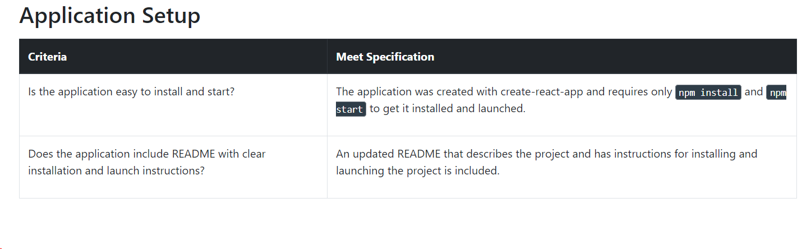

# BookStore

## Description
This project is part of [Udacity React Nanodegree course](https://www.udacity.com/course/react-nanodegree--nd019) which consist of topics :-
* Rendering UI with React
* Lifecycle Events
* State Management
* React Router

## Requirement Of this project is : -

----
1. 
---
2. 
---
3. 
---
4. 

## To  run this application

* install all project dependencies with `npm install`
* start the development server with `npm start` 

## Credit
This project was bootstrapped with this [Repo](https://github.com/udacity/reactnd-project-myreads-starter).
